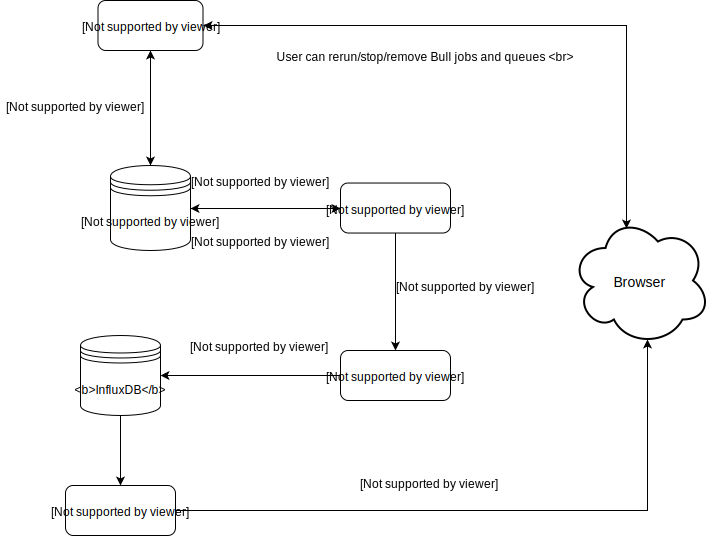

# Rigoblock Stats


## Services

### Traefik

Træfik is a modern HTTP reverse proxy and load balancer that makes deploying microservices easy.

### Chronograf

Chronograf is a UI dashboard that allows us to see the data that we have stored in InfluxDB and build robust queries and alerts. We have our dashboards exported and saved in the `dashboards` folder, so that they can be imported on Chronograf locally in case we need them for testing.

### Bull

Bull is a package that allows us to create queues of repeatable jobs, configurated using a cron expression. Our package is set up to have one queue for each different task. Tasks can be found in the folder of the same name, while queues are listed in `src/config.ts`.
To add a new queue, simply add it to the `config.ts` file following the template we used.
To add a new task, write an async function that accepts a `job` and a `web3` parameters and returns a promise. Make sure to wrap the task with `web3ErrorWrapper` to handle the closing of the websocket connection and possible web3 errors.

### Arena

Arena is an interactive UI dashboard for Bull and Bee Queue. It allows us to monitor the status of jobs, see the cause of failure in case they failed and also remove or rerun jobs.

## Setup

Add `rbstats` system user:

```sh
adduser rbstats
```

Clone the repo into `rbstats` home:

```sh
su rbstats
cd ~
clone https://github.com/RigoBlock/rigoblock-monorepo
```

Copy help script into the home directory:

```sh
cp rigoblock-monorepo/packages/stats/scripts/* ./
chmod u+x *.sh
```

Create data diretory:

```
mkdir data
```

Create `acme.json` file. This file contains private keys. Protect it.

```
touch rigoblock-monorepo/packages/stats/config/traefik/acme.json
chmod 600 rigoblock-monorepo/packages/stats/config/traefik/acme.json
```

Build the docker image (from the monorepo root).

```
docker-compose -f ./packages/stats/docker-compose.prod.yml build --build-arg NPM_KEY=<insert npm key> bull
```

## Run the whole stack (from the monorepo root).

```sh
docker-compose -f ./packages/stats/docker-compose.prod.yml up
```

## Tasks

- [calculateBalance](src/tasks/calculateBalance/README.md)
- [calculateEthBalance](src/tasks/calculateEthBalance/README.md)
- [fetchDragos](src/tasks/fetchDragos/README.md)
- [getSharePrice](src/tasks/getSharePrice/README.md)
- [getTotalSupply](src/tasks/getTotalSupply/README.md)

## Data currently being fetched

- List of all Dragos on mainnet, ropsten and kovan

For each drago, we are fetching:

- ETH balance
- GNT balance
- GRG balance
- MKR balance
- WETH balance
- USDT balance
- ZRX balance
- ZRXW balance
- USDTW balance
- GRGW balance
- Total supply
- Buy-Sell prices
